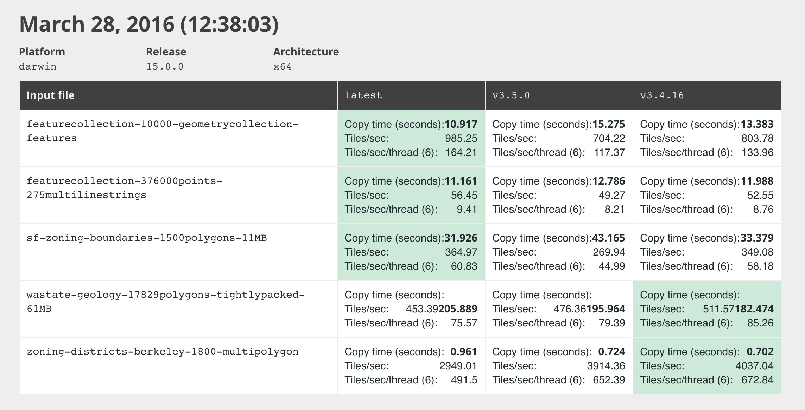

# Node Mapnik Bench

[](https://travis-ci.org/mapbox/node-mapnik-bench)

**node-mapnik-bench** is a set of scripts used for testing performance between versions of Node Mapnik.



## Setup

This will install some basic node.js deps into `./node_modules` and it will install node-mapnik binaries + related tilelive modules into the `./mapnik-versions` directory.

Clone repository

```
git clone git@github.com:mapbox/node-mapnik-bench.git
```

Install dependencies

```
npm install
```

Install Node Mapnik versions you'd like to benchmark

```
cd mapnik-versions/<version>
npm install
```

To install files needed for the benchmark (this takes a little while):

```sh
node scripts/download.js
```

## Usage

There are three major ways to use Node Mapnik Bench. 

#### bin: `bench`

```bash
usage:
  bench <file> <list of mapnik versions>

example:
  # will test us-counties-polygon against latest and v3.5.0 versions of Node Mapnik
  bench ./test/fixtures/us-counties-polygons.geojson latest v3.5.0

output:
  # { source: '/Users/mapsam/mapbox/node-mapnik-bench/test/fixtures/us-counties-polygons.geojson',
  #   version: 'v3.5.0',
  #   options: { threadpool: 6 },
  #   time: 
  #     { start: 1460401496573,
  #       xml: 1460401496796,
  #       bridge: 1460401496835,
  #       info: 1460401496835,
  #       load: 1460401496835,
  #       copy: 1460401497500 },
  #   sink: 'noop://',
  #   memory: 
  #   { max_rss: '51.02MB',
  #     max_heap: '12.07MB',
  #     max_heap_total: '29.71MB' },
  #   tile_count: 533 }
```

#### bin: `benchall`

Test a group of files

```bash
usage:
  benchall <fixture_index> <type> <list of mapnik versions>

example:
  # will test all geojsons in /testcases against latest and v3.5.0 versions of Node Mapnik
  benchall ./testcases/index.js geojson latest v3.5.0

output:
  # saves a timestamped JSON file to /visual
  visual/1454461994.json
```

View the output by opening the JSON with `visual/index.html` file.

```
cd visual
python -m SimpleHTTPSever
localhost:8000/visual/index.html?1454461994 # in your browser
```

#### `bench(file, version, options, callback)`

```javascript
var bench = require('./lib/index.js');

bench('./test/fixtures/us-counties-polygons.geojson', 'latest', options, function(err, stats) {
  if (err) throw err;
  console.log(stats); // same as JSON from ./bin/bench above
});
```

## Testcases

In order to test an entire suite of files against multiple versions of Node Mapnik, they must be structured in a particlar manner. Check out the [`testcases`](https://github.com/mapbox/node-mapnik-bench/tree/master/testcases) directory to get started.

#### Add a new testcase

TODO

## Mapnik versions

All of the mapnik versions we test are in the `mapnik-versions` directory. **To add a new version** you can create a new directory named after the tag, branch, or gitsha you would like to use. The name of the directory is the name you'll use in the benchmark commands.

Add a `package.json` with the proper pointers - here is what `latest` looks like:

```JSON
{
  "name": "gdal-tiling-bench-version",
  "version": "1.0.0",
  "main": "package.json",
  "dependencies": {
    "mapnik": "https://github.com/mapnik/node-mapnik/tarball/master",
    "tilelive-bridge":"https://github.com/mapbox/tilelive-bridge/tarball/master"
  }
}
```

Once added, you can `npm install` in that new directory.

## Test

```
npm test
```